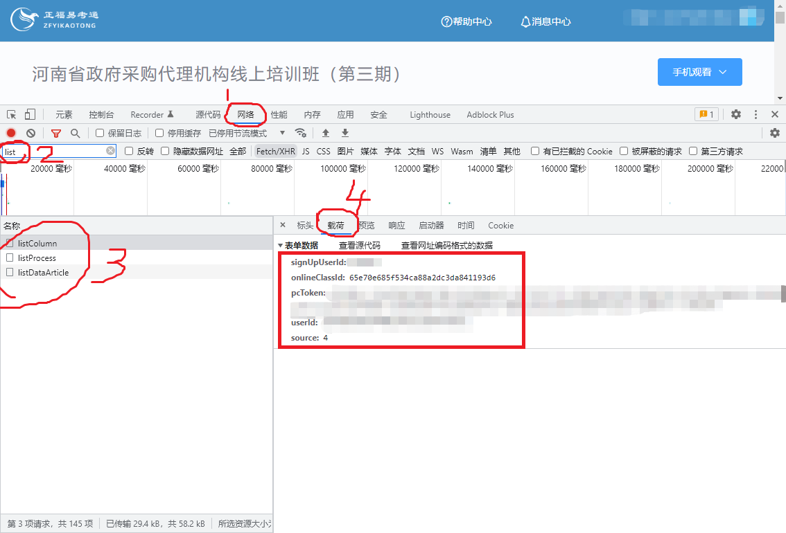

# 正福易考通自动脚本

正福易考通课程自动学习并自动回答随堂小考。

## 用法

假设您已经安装了 [PHP](https://www.php.net/downloads) 和 [Composer](https://getcomposer.org/download/) ；

* 克隆代码

```bash
git clone git@github.com:bitis/ykt.git
```

* 安装扩展

```bash
cd ykt
composer install
```

* 开始运行

获取你自己的账号数据替换以下命令种的 `signUpUserId` `onlineClassId` `pcToken` `userId`

```bash
php app.php signUpUserId onlineClassId pcToken userId
```

## 如何获取参数

* 登录易考通
* 按下 <kbd>F12</kbd>  打开调试窗口
* 选择`网络`标签， 搜索 `list` 后，选中任意一个结果，点击`载荷`
* 依次复制`signUpUserId` `onlineClassId` `pcToken` `userId`



